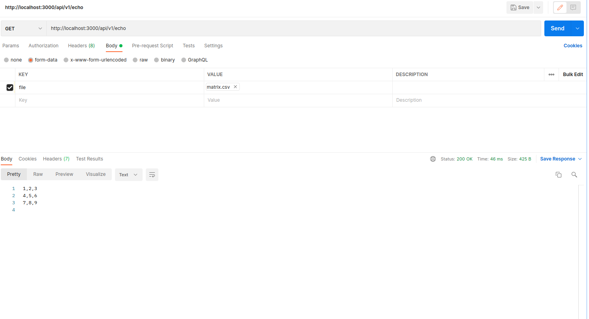
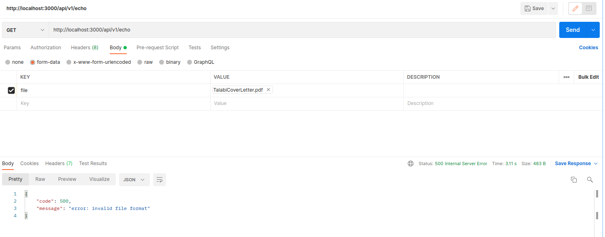

# Gorray
This project is to implement certain features/endpoints

Accepting as input a csv file upload named 'file' containing the matrix
```
1,2,3
4,5,6
7,8,9
```
## Features/Endpoints :

- echo
    ```
    1,2,3
    4,5,6
    7,8,9
    ```

- transpose
    ```
    1,4,7
    2,5,8
    3,6,9
    ```

- flatten
    ```
    1,2,3,4,5,6,7,8,9
    ```
- sum
    ```
    45
    ```

- multiply: 
    ```
    362880
    ```

# Unit tests
```
cd test
go test -v ./...
```

# Run the code(Docker)
```
docker-compose up
```
# Sample request

## via curl
```
curl -F 'file=@/path/matrix.csv' "http://localhost:3000/api/v1/echo"
```

## via postman
- Success

    

- Invalid file format

    